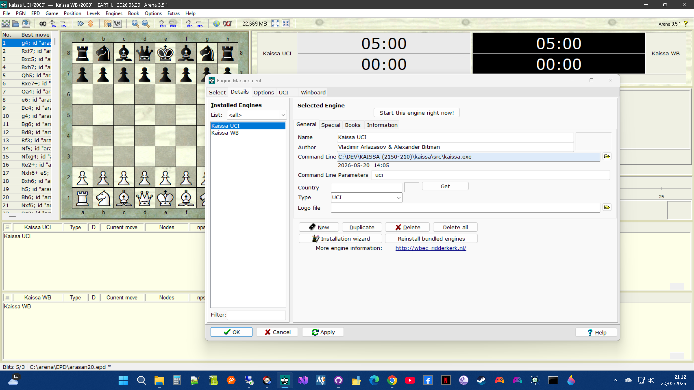

# Kaissa
Groundbreaking 1970s era chess machine, now with full UCI support

## About:
A chess engine developed in the Soviet Union in the 1960s. It became the first world computer chess champion...(1974 in Stockholm).


## Features
https://www.chessprogramming.org/Kaissa

https://en.wikipedia.org/wiki/Kaissa

## Port
This code has been ported and updated for modern systems by Jim Ablett, and runs via WinBoard.

See: https://talkchess.com/viewtopic.php?t=86229

## Additions/Changes:

This repository contains Jim's orignal port and the following additions/changes:
- Full UCI support
- Formatting -> 4 space tabs replaced with 2 space tabs
- Clang local variable and function parameter const warnings resolved

These don't change the core logic in any way, but are compiler friendly.

See: https://clang.llvm.org/extra/clang-tidy/checks/misc/const-correctness.html

Nothing else has been altered, as my intention was to change as little as possible in an effort to preserve the original programming of this historic engine, especially concerning the core functionality (movegen, search, eval, etc.)

## Protocol modes
The engine supports 3 modes: console, winboard, and UCI.
Protocol and play options are selected via command-line parameters.

For example:

- kaissa.exe -uci -nobook -post
- kaissa.exe -wb -nobook -post

You can use included wb.bat or uci.bat to start the engine this way.

## Console Mode
Console mode is the default if starting the engine without parameters-> "kaissa.exe", after that just hit ENTER to start a game.

In console mode, you simply make your move in algebraic format, for ex: e2e4 then hit enter.
After the engine announces it's move, Kaissa will make it's move and you'll see the current board reprentation.

## Arena
Choose Engines then Manage from the drop down menu.

Add -uci to the engine's Command Line Parameter input field.



## Compiling
Visual Studio 2026 project files are included.

It also compiles cleanly in the MSYS2 Mingw64 environment using the included makefile.

## Perft Results
Processor 13th Gen Intel(R) Core(TM) i9-13900K (3.00 GHz)
Installed RAM 32.0 GB (31.7 GB usable)

```
chess6.exe -uci
perft 6
```