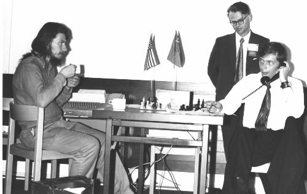
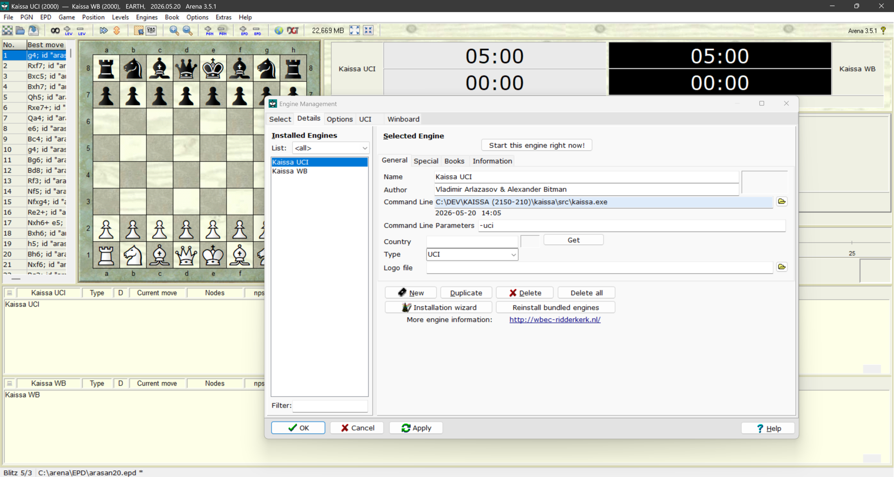

# Kaissa
Groundbreaking 1970s era chess machine, now with full UCI support

## About:
A chess engine developed in the Soviet Union in the 1960s. It became the first world computer chess champion...(1974 in Stockholm).



## Features
https://www.chessprogramming.org/Kaissa

https://en.wikipedia.org/wiki/Kaissa

## Port
This code has been ported and updated for modern systems by Jim Ablett, and runs via WinBoard.

See: https://talkchess.com/viewtopic.php?t=86229

## Additions/Changes:

This repository contains Jim's orignal port and the following additions/changes:
- Full UCI support, including:

```
process_uci_command
parse_uci_position
parse_uci_setoption
uci_new_game
parse_uci_go
void uci_go_search
void send_uci_bestmove
print_uci_score
```

- Formatting -> 4 space tabs replaced with 2 space tabs
- Clang local variable and function parameter const warnings resolved

These don't change the core logic in any way, but are compiler friendly.

See: https://clang.llvm.org/extra/clang-tidy/checks/misc/const-correctness.html

Nothing else has been altered, as my intention was to change as little as possible in an effort to preserve the original programming of this historic engine, especially concerning the core functionality (movegen, search, eval, etc.)

## Protocol modes
The engine supports 3 modes: console, winboard, and UCI.
Protocol and play options are selected via command-line parameters.

For example:

- kaissa.exe -uci -nobook -post
- kaissa.exe -wb -nobook -post

You can use included wb.bat or uci.bat to start the engine this way.

## Console Mode
Console mode is the default if starting the engine without parameters-> "kaissa.exe", after that just hit ENTER to start a game.

In console mode, you simply make your move in algebraic format, for ex: e2e4 then hit enter.
After the engine announces it's move, Kaissa will make it's move and you'll see the current board reprentation.

## Arena
Choose Engines then Manage from the drop down menu.

Add -uci to the engine's Command Line Parameter input field.



## Compiling
Visual Studio 2026 project files are included.

It also compiles cleanly in the MSYS2 Mingw64 environment using the included makefile.

## Perft Results
Processor 13th Gen Intel(R) Core(TM) i9-13900K (3.00 GHz)
Installed RAM 32.0 GB (31.7 GB usable)

```
> perft 5
b1a3: 198572
b1c3: 234656
g1f3: 233491
g1h3: 198502
a2a3: 181046
a2a4: 217832
b2b3: 215255
b2b4: 216145
c2c3: 222861
c2c4: 240082
d2d3: 328511
d2d4: 361790
e2e3: 402988
e2e4: 405385
f2f3: 178889
f2f4: 198473
g2g3: 217210
g2g4: 214048
h2h3: 181044
h2h4: 218829

Nodes = 4865609
Time = 1170 ms
NPS = 4158640

> perft 6
b1a3: 4856835
b1c3: 5708064
g1f3: 5723523
g1h3: 4877234
a2a3: 4463267
a2a4: 5363555
b2b3: 5310358
b2b4: 5293555
c2c3: 5417640
c2c4: 5866666
d2d3: 8073082
d2d4: 8879566
e2e3: 9726018
e2e4: 9771632
f2f3: 4404141
f2f4: 4890429
g2g3: 5346260
g2g4: 5239875
h2h3: 4463070
h2h4: 5385554

Nodes = 119060324
Time = 31307 ms
NPS = 3802993
```